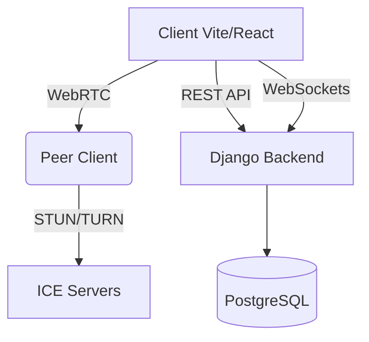

# 🌐 P2P Connect - Secure Peer-to-Peer Platform


A production-grade peer-to-peer communication platform with modern frontend (Vite + React) and robust backend (Django). Enables secure, real-time interactions between users with complete data ownership.

##  Live Deployment

[](https://client-p2p-platform.com)  
[](https://staging.client-p2p-platform.com)

## ✨ Core Features

- **Zero Trust Architecture**: End-to-end encrypted communications
- **Real-Time Connectivity**: WebRTC for browser-to-browser connections
- **Hybrid P2P Model**: Django coordination server with client-direct connections
- **Modern UI**: Responsive design with dark/light mode support
- **Session Management**: JWT authentication with refresh tokens
- **Media Streaming**: Optimized for video/audio/data transfer

##  System Architecture




##  Technology Stack

### Frontend (Vite + React)

- **Vite 4** – Next-gen frontend tooling for faster builds
- **React 18** – With hooks and context API
- **Default CSS** – No utility frameworks, just clean and simple styling
- **WebRTC** – Real-time peer connections and data channels
- **Axios** – For HTTP API requests
- **Zustand** – Lightweight state management library

## 📦 Installation & Setup


### Frontend Setup

```bash
git clone https://github.com/emmanuelronoh/P2P-Website.git
cd P2P-Website
npm install
npm run dev 